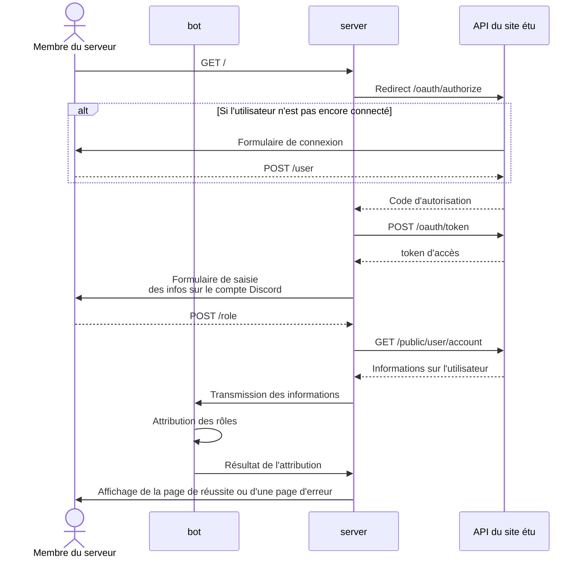

Les membres du serveur Discord peuvent (et doivent !)
s'authentifier au moyen de l'API du site étu.
Cette authentification permet automatiquement :

- d'attribuer le pseudo utilisé sur le serveur ;
  ce dernier est de la forme `<prénom> <nom> - <nom de la branche>`.
- d'attribuer les rôles du membre :
    - Étudiant/Ancien étudiant/Enseignant
    - S'il est étudiant, le(s) rôle(s) de sa ou ses formations
    - S'il est étudiant, ses rôles d'UE.

!!!note "Pseudo Discord"

    Comme un pseudo Discord ne peut faire plus de 32 caractères,
    la sélection de celui-ci a quelques subtilités.
    Pour plus de détails, voir 
    [UserService.get_server_nickname][etuutt_bot.services.user.UserService.get_server_nickname]

## Déroulement de l'authentification

Pour l'authentification, plusieurs acteurs sont nécessaires :

- l'API du site étu ; celle-ci fonctionne indépendamment du bot (tant que le site tourne)
- le serveur du bot ; celui-ci est géré par le même processus que le bot
- le bot
- Et bien sûr, l'utilisateur

Pour accomplir l'opération, l'utilisateur va se rendre
sur un formulaire fourni par le serveur du bot.
Le serveur va ensuite interagir avec l'API du site
étu pour récupérer les informations utilisateur
puis utiliser les services du bot pour attribuer le pseudo et les rôles.

