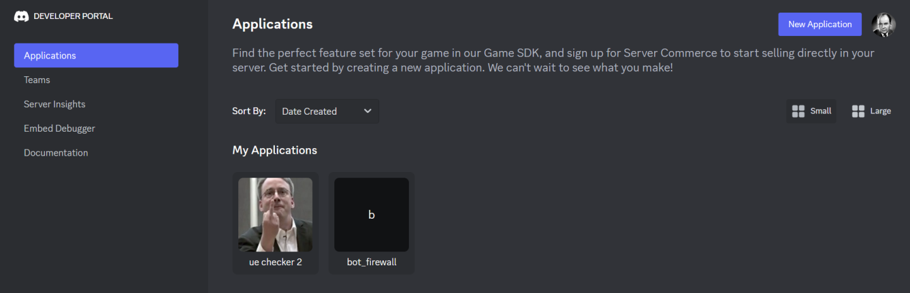
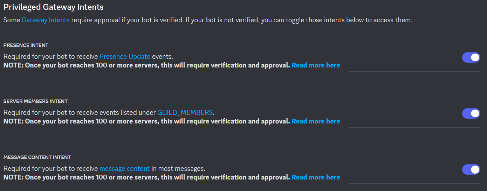
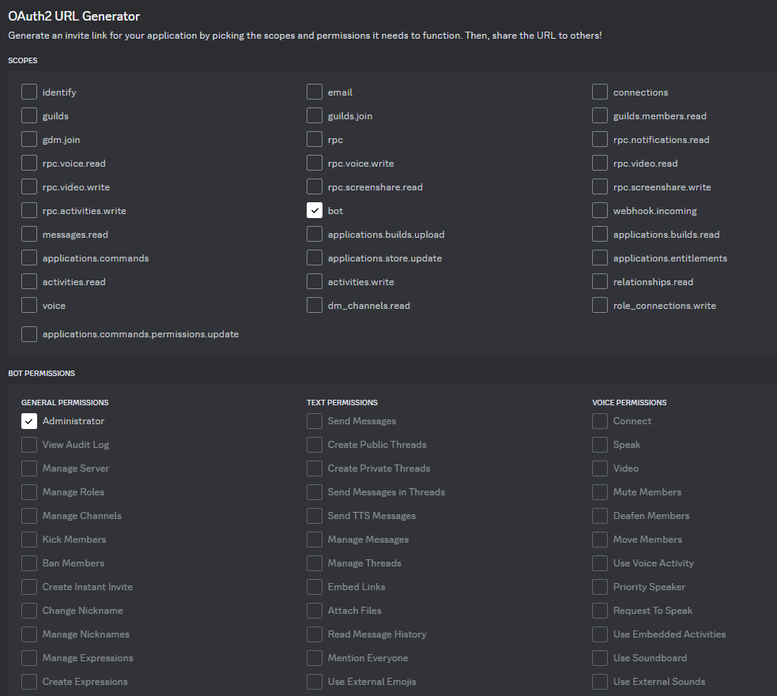

## Prérequis

Pour installer le projet, vous aurez besoin de :

- git ([documentation officielle](https://git-scm.com/book/fr/v2/D%C3%A9marrage-rapide-Installation-de-Git))
- Python >=3.10 ([documentation officielle](https://docs.python.org/3/))

Si une ou plusieurs de ces dépendances ne sont pas présentes sur votre
ordinateur, référez-vous aux instructions d'installation données ci-dessous.
Si toutes les dépendances sont présentes et à jour, vous pouvez passer
directement à [la partie suivante](#mise-en-place-du-projet).

### Python

Le projet est conçu pour fonctionner avec Python 3.10 ou au-dessus.

Pour vérifier votre version de Python, exécutez la commande suivante dans votre terminal :

```bash
python --version
```

Si la commande renvoie une version inférieure à 3.10
ou si la commande n'est pas reconnue,
vous devez installer Python.

=== "Windows"

    === "Avec l'exécutable"

        Rendez-vous sur le [site officiel de Python](https://www.python.org/downloads/),
        téléchargez le programme d'installation et exécutez-le.
        
        !!!PATH
    
            Pensez à cocher la case `Add Python to PATH` lors de l'installation.

    === "Avec Winget"

        dans Powershell avec accès admins :

        ```powershell
        winget install Python.Python
        ```

    === "Avec Scoop"

        dans Powershell :

        ```powershell
        scoop install python
        ```

=== "Linux"

    Sur Linux, vous pouvez installer Python à l'aide de votre gestionnaire de paquets.

    === "Debian/Ubuntu"
    
        ```bash
        sudo apt install python3
        # on sait jamais
        sudo apt install python-is-python3
        ```

        Par défaut, Ubuntu 22.04 utilise Python 3.10.
        Ce n'est pas la plus récente, mais elle est compatible
        avec le projet.

        !!!note

            Comme le gestionnaire APT est ~~souvent en retard~~ stable,
            il est conseillé d'utiliser `pyenv` si vous voulez utiliser
            la version la plus à jour de Python.
            Voir sa [documentation](https://github.com/pyenv/pyenv).

            Alternativement, il est possible d'ajouter le PPA
            [deadsnakes](https://launchpad.net/~deadsnakes/+archive/ubuntu/ppa)
            pour avoir un choix de versions de Python sur Ubuntu :
            
            ```bash
            sudo add-apt-repository ppa:deadsnakes/ppa
            ```
    
    === "Fedora"
    
        ```bash
        sudo dnf install python3
        ```
    
    === "Arch Linux"
    
        ```bash
        sudo pacman -Syu python
        ```

=== "macOS"

    Sur macOS, vous pouvez installer Python à l'aide de
    [Homebrew](https://brew.sh/).
    
    ```bash
    brew install python
    ```

### Git

Git est un logiciel de gestion de versions décentralisé.
Il est utilisé pour gérer le code source du projet.

Si Git n'est pas déjà installé, suivez les instructions suivantes :

=== "Windows"

    === "Avec l'exécutable"

        Rendez-vous sur le 
        [site officiel de Git](https://git-scm.com/book/en/v2/Getting-Started-Installing-Git),
        téléchargez le programme d'installation et exécutez-le.

    === "Avec Winget"

        Dans Powershell avec accès admins :

        ```powershell
        winget install Git.Git
        ```

    === "Avec Scoop"

        Dans Powershell :
        
        ```powershell
        scoop install git
        ```

=== "Linux"

    Sur Linux, vous pouvez installer Git à l'aide de votre gestionnaire de paquets.

    === "Debian/Ubuntu"

        ```bash
        sudo apt install git
        ```

    === "Fedora"

        ```bash
        sudo dnf install git
        ```

    === "Arch Linux"

        ```bash
        sudo pacman -Syu git
        ```

=== "macOS"

    Sur macOS, vous pouvez installer Git à l'aide de
    [Homebrew](https://brew.sh/).

    ```bash
    brew install git
    ```

Pour vérifier que l'installation a réussi,
exécutez la commande suivante dans votre terminal :

```bash
git --version
```

## Mise en place du projet

Clonez le dépôt Git du projet :

```bash
git clone https://github.com/ungdev/EtuUTT-Discord-Bot.git
```

Puis, placez-vous dans le répertoire :

```bash
cd EtuUTT-Discord-Bot
```

Assurez-vous que vous êtes bien sur la branche `main`

```bash
git checkout main
```

Puis installez les dépendances (de préférence dans un
[venv](https://docs.python.org/3/library/venv.html)).
Vous pouvez choisir d'installer les dépendances
pour compiler la documentation ou non.

```
pip install -U -r requirements-dev.txt
# ou
pip install -U -r requirements-docs.txt
```

## Configuration du projet

Pour bien fonctionner, le bot a besoin d'un peu de configuration.
Deux fichiers contiennent des exemples de ce qui est attendu comme
configuration.
Copiez ces fichiers :

```bash
cp .env.example .env
cp data/discord.example.toml data/discord.toml
```

### Où est la configuration ?

La configuration est répartie entre les deux fichiers ainsi créés,
en suivant cet esprit :

- Le `.env` contient spécifiquement les variables d'environnement.
  On y met les variables qui doivent être les plus aisément accessibles
  et modifiables par le SIA (Service d'Information des Associations).
  Par exemple, les identifiants et mots de passe, le niveau de log et le token du bot.
- le `discord.toml` contient les variables relatives au bot et au serveur
  qui n'ont pas un besoin impératif d'être modifiées par le SIA.
  Par exemple, l'id du serveur, les ids des rôles spéciaux
  où les catégories destinées à avoir des salons d'UE.

Pour savoir où une variable doit se trouver, imaginez-vous en tant qu'admin du serveur,
puis imaginez-vous en tant que respo SIA.
Ensuite, demandez-vous dans lequel de ces rôles,
vous auriez le plus besoin d'accéder à cette variable.

Si c'est en tant qu'admin Discord, la variable va dans le `discord.toml`.
Si c'est en tant que respo SIA, la variable va dans le `.env`.

### Créer un bot

Une grande partie de la configuration implique de conserver en dur
des variables relatives directement à Discord.

Nous vous conseillons donc de créer un bot et un serveur rien qu'à vous,
qui vous serviront uniquement à faire vos tests.
La création du serveur est une tâche facile et laissée comme
exercice au lecteur.
Pour la création du bot, rendez-vous sur
[le portail des développeurs](https://discord.com/developers/applications).

Ça devrait ressembler à ça :

<figure markdown="span">
    
    <figcaption>Portail des applications de Discord</figcaption>
</figure>

Cliquez sur le bouton `New Application` en haut à droite.
Rentrez le nom de votre bot, acceptez les conditions de Discord et validez.

Sur la page de votre application, rendez-vous dans l'onglet `Bot`.
Si vous voulez, choisissez une icône pour votre bot.
Générez un token et copiez-le dans la variable `BOT__TOKEN` du `.env`

!!!danger

    Le token de votre bot ne doit **JAMAIS** être visible par quelqu'un d'autre.
    Si votre bot est récupéré une personne mal intentionnée, ça peut être
    extrêmement dangereux.
    Faites bien attention à ça.

    Rassurez-vous cependant, si jamais vous faites une erreur
    et que votre token se retrouve sur un repo GitHub ou dans un message
    Discord, Discord le détectera immédiatement et révoquera le token
    de votre bot sans attendre.
    Votre bot sera toujours utilisable, mais à condition de générer un nouveau token.

Une fois le token de votre bot renseigné,
configurez les *Intents*.
Le bot EtuUTT a besoin de tous les *Intents*.

<figure markdown="span">
    
    <figcaption>*Intents* requis</figcaption>
</figure>

!!!note

    Vous pouvez décocher la case `Public Bot` afin d'éviter que
    d'autres personnes que vous puissent ajouter votre bot de test
    dans des serveurs.

Maintenant, rendez-vous dans l'onglet `Oauth2`,
à la section `URL Generator`.
Renseignez le scope de votre application,
puis les permissions requises.
Le scope `bot` est nécessaire.
Pour les permissions, vous pouvez lui donner la permission `admin`,
qui inclue toutes les autres.

<figure markdown="span">
    
    <figcaption>Scope et permissions</figcaption>
</figure>

!!!note

    Si jamais vous créez un jour un bot destiné à être réellement utilisé,
    évitez de lui donner la permission administrateur.
    Préférez donner exactement les permissions nécessaires et pas une de plus.

    Mais ici, on crée un bot de test, donc ça ne pose pas trop
    de problème et ça simplifie la configuration.

Copiez-collez l'URL générée dans un onglet de votre navigateur.
Vous serez redirigé vers la page d'invitation du bot sur un serveur.
Sélectionnez votre serveur de test.

Et voilà, votre bot est prêt à fonctionner.

### Configurer le serveur

Maintenant que vous avez votre bot et votre serveur,
vous allez pouvoir remplir le `discord.toml`.

Pour cela, vous devez faire les actions suivantes sur votre serveur :

1. Copiez-collez l'id du serveur dans `guild.id`
2. Créez un salon textuel et copiez-collez son id dans `guild.channel_admin_id`
3. Générez une invitation et copiez-collez la dans `guild.invite_link`
4. Créez cinq rôles, et copiez-collez leur id dans les cinq variables
   de la catégorie `guild.special_roles`
5. Créez deux catégories, nommées respectivement `ME` et `TC`
   et copiez-collez leur id dans les variables `id` des deux `[[categories]]` correspondantes
6. Créez deux nouveaux rôles, et copiez-collez leur id dans les variables
   `elected_role` des deux `[[categories]]`

Si vous voulez, vous pouvez rajouter plus de salons et de catégories, mais
ce n'est pas nécessaire pour le bon fonctionnement du bot.

!!!question "Je ne trouve pas les ids"

    L'id d'un salon, d'une catégorie, d'un utilisateur et de presque tout sur Discord
    se trouve en faisant un clic droit sur l'objet et en cliquant sur
    "Copier l'identifiant du [message/salon/utilisateur/...]" dans le menu contextuel.
    Cette option devrait être celle tout en bas.

    Si vous ne la voyez pas, vous devez vous rendre dans vos paramètres utilisateur,
    puis `Paramètres de l'appli` > `Avancés` et activer le mode développeur.

## Lancement du bot

Maintenant que tout est configuré, vous pouvez lancer le bot.
Pour cela, exécutez la commande suivante dans votre terminal :

```bash
python -m etuutt_bot
```

Rendez-vous dans le salon que vous avez configuré comme étant celui
dédié à l'administration du serveur.
Le bot devrait y avoir posté un message pour signaler sa mise en ligne.

Si ça ne marche pas, vous pouvez trouver les logs dans le fichier `data/logs/log`.
